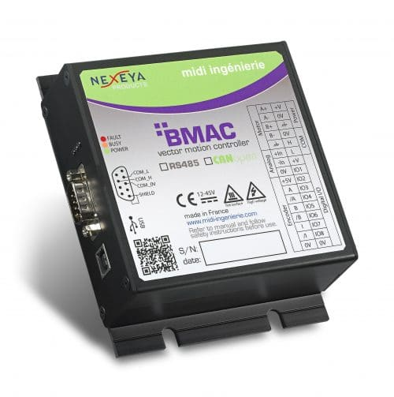

# pyshell

python script for serial communication with Midi Ingenierie DMAC/BMAC modules

 Some comments are in french. Translation will be done later.

*The provided code is for informational purposes only. We are not liable for any malfunctions or issues resulting from its use.*

## Additional resources

[Midi Ingenierie](https://www.midi-ingenierie.com)

[PySerial](https://pypi.org/project/pyserial/)
